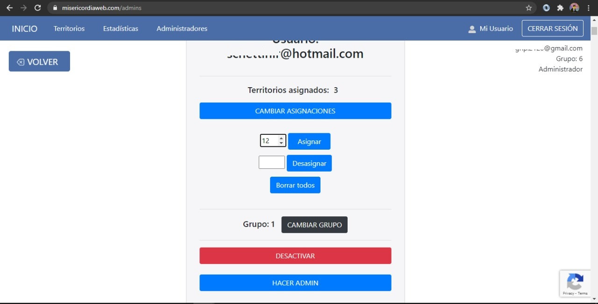
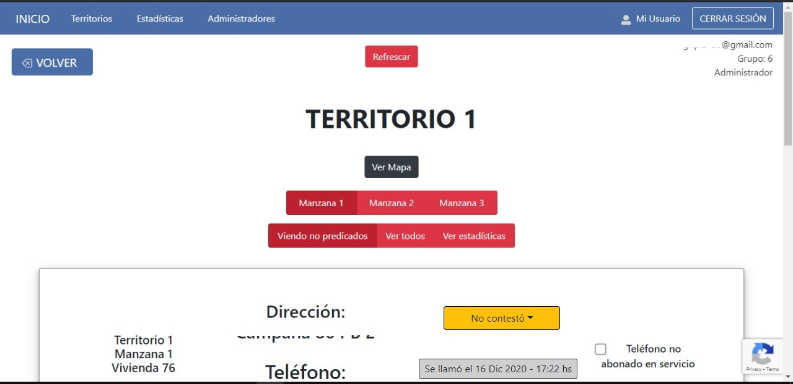
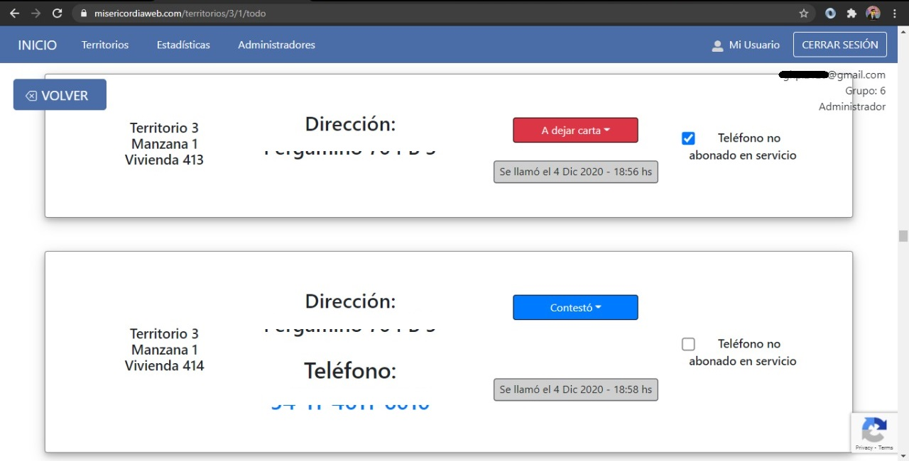
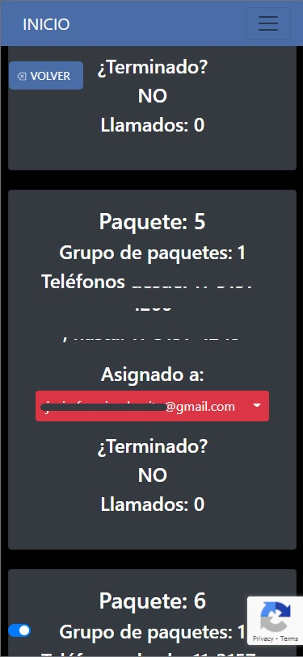

# registros-client

Aplicación frontend en React y TypeScript con React Router, Router Dom, Hooks y Redux

[https://misericordiaweb.com/]

Corriendo en AWS Amplify y enrutada por Route 53

Consume la Restful API [registros-rest-api]

GraphQL desde Apollo Client, subscripciones por el mismo puerto (split)

Usuarios desde Redux Thunk, registro, login, roles

Google Recaptcha 3

CSS desde JavaScript con Styled-Components

[https://misericordiaweb.com/]: <https://misericordiaweb.com/>
[registros-rest-api]: <https://github.com/gustavoghp87/registros-rest-api/>
